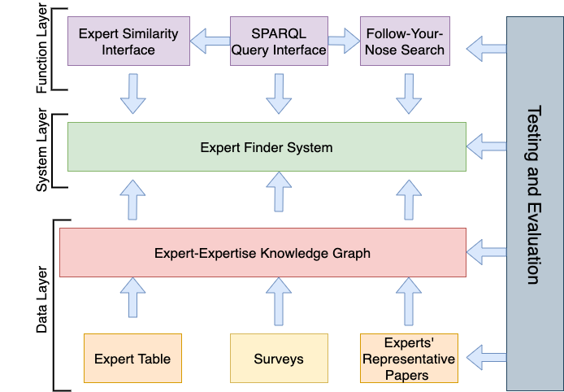
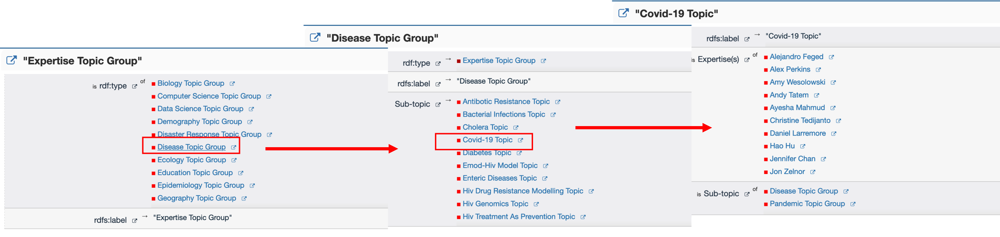
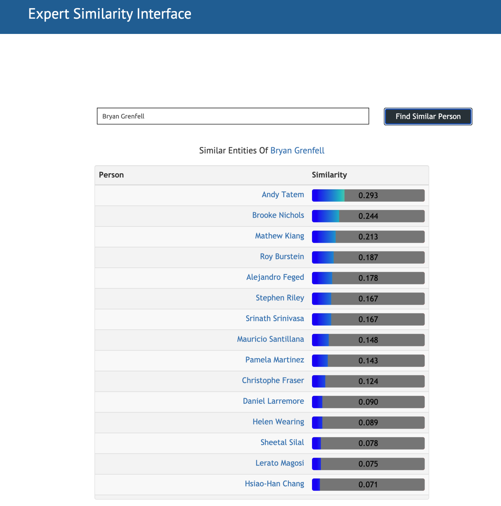

# Expert-System
This is the repository for the paper "Providing Humanitarian Relief Support through Knowledge Graphs"

# Table of contents
1. [Expert System Overview](#system)
2. [Schemas](#schema)
3. [Instance Data](#data)
    1. [Event View](#event)
    2. [Expert View](#expert)
4. [Interfaces](#interface)
    1. [Follow-your-Nose Search](#phuzzy)
    2. [Expert Similarity](#similarity)
5. [Competency Questions](#query)
    

# Expert System Overview 

# Schemas 

# Instance Data 
## Event View 

## Expert View 

# Interfaces 

## Follow-your-Nose Search 

## Expert Similarity Search 

# Competency Questions 
## Query one [need a sentence in natual language]

