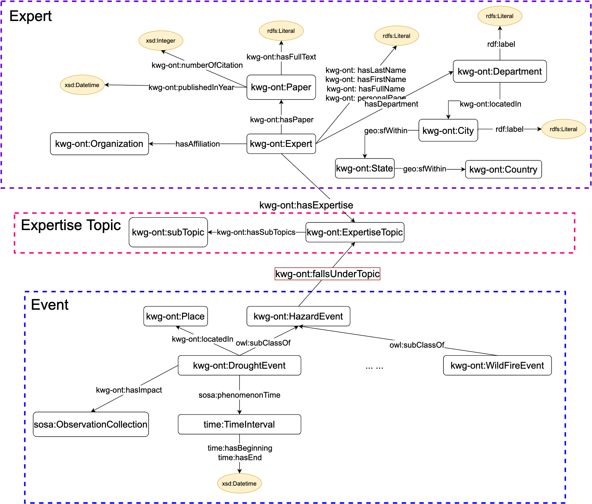

# Expert-System
This is the repository for the paper "Providing Humanitarian Relief Support through Knowledge Graphs"

# Table of contents
1. [Expert System Overview](#system)
2. [Schemas](#schema)
3. [Instance Data](#data)
    1. [Event View](#event)
    2. [Expert View](#expert)
4. [Interfaces](#interface)
    1. [Follow-your-Nose Search](#phuzzy)
    2. [Expert Similarity](#similarity)
5. [Competency Questions](#query)
    


# Expert System Overview <a name="system"></a>


# Schemas <a name="schema"></a>


# Instance Data <a name="data"></a>
## Event View <a name="event"></a>


## Expert View <a name="expert"></a>


# Interfaces <a name='interface'></a>

## Follow-your-Nose Search <a name="phuzzy"></a>


## Expert Similarity Search <a name="similarity"></a>


# Competency Questions <a name='query'></a>

endpoint: http://stko-roy.geog.ucsb.edu:7202/sparql

repository: KnowWhereGraph-V1

interface:


## Query One
“Who has expertise related to diseases in the Sahel region?”

```SPARQL
PREFIX kwgr: <http://stko-roy.geog.ucsb.edu/lod/resource/>
PREFIX kwg-ont: <http://stko-roy.geog.ucsb.edu/lod/ontology/>
PREFIX rdfs: <http://www.w3.org/2000/01/rdf-schema#>
SELECT ?expert_fullName ?title ?affiliation ?expertise_topic
where { 
    ?expert a kwg-ont:Expert ;
            kwg-ont:fullName ?expert_fullName ;
            kwg-ont:hasTitle/rdfs:label ?title;
            kwg-ont:hasAffiliation/rdfs:label ?affiliation;
            kwg-ont:hasExpertise ?expertise.
    ?expertise kwg-ont:hasTopic/rdfs:label ?expertise_topic.
    ?expertise kwg-ont:scopedBy/kwg-ont:hasSpatialScope kwgr:Earth.North_America.USA.5_1 .
    filter(regex(?expertise_topic, "disease", "i"))
}
```

## Query Two
“Show me all Experts in Hurricane Events.”

```SPARQL
  PREFIX kwgr: <http://stko-roy.geog.ucsb.edu/lod/resource/>
  PREFIX kwg-ont: <http://stko-roy.geog.ucsb.edu/lod/ontology/>
  PREFIX rdfs: <http://www.w3.org/2000/01/rdf-schema#>
 
 select ?expert_name where {
      ?expert kwg-ont:hasExpertise kwgr:topic.hurricanes ;  
        rdfs:label ?expert_name . 
} 
```
